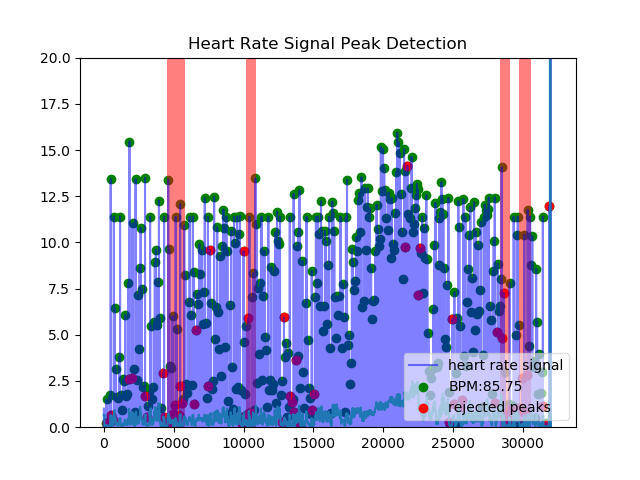
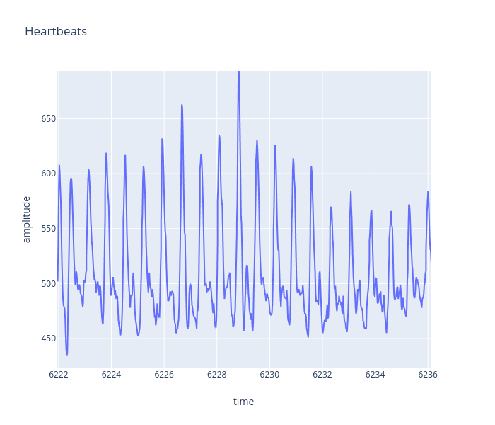
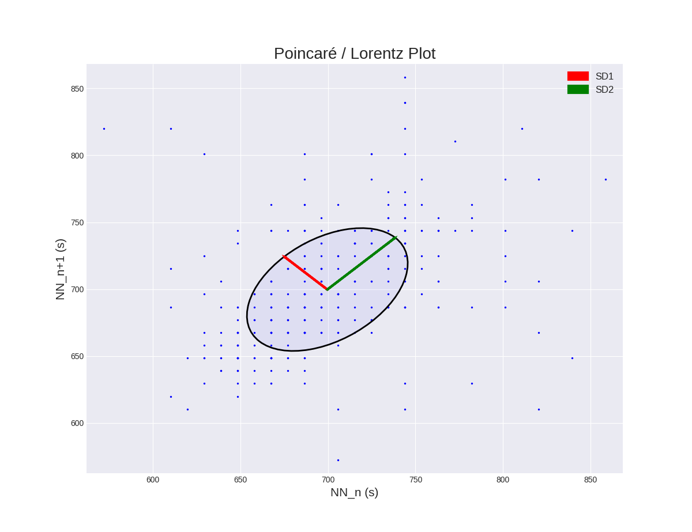

# hrv-analysis ⚕️ ❤️

This a set of scripts used for extracting and analyzing (mainly HRV) photoplethysmograph samples using the [PulseSensor](https://pulsesensor.com) connected to an Arduino, while running their serial script found [here](https://raw.githubusercontent.com/WorldFamousElectronics/PulseSensorPlayground/master/examples/PulseSensor_BPM/PulseSensor_BPM.ino). 

<!--  -->

For the script to get the samples through serial, the script must be set in mode *`PROCESSING_VISUALIZER`* instead of *`SERIAL_PLOTTER`*.

By default, the serial port `dev/ttyACM0` is used, but you can change the variable `port` in [`take-sample.py`](take-sample.py).

An example (16.000 bytes) csv file outputted by the script can be found on [`samples/example.csv`](samples/example.csv).

Note that for the moment, the time column outputted in the samples is generated on the go by local CPU time, which I'm not sure is optimal at all for HRV calculation.

Two libraries are used for HRV calculation, [heartpy](https://github.com/paulvangentcom/heartrate_analysis_python) and [hrvanalysis](https://github.com/Aura-healthcare/hrvanalysis) (which uses heartpy's intervals).
